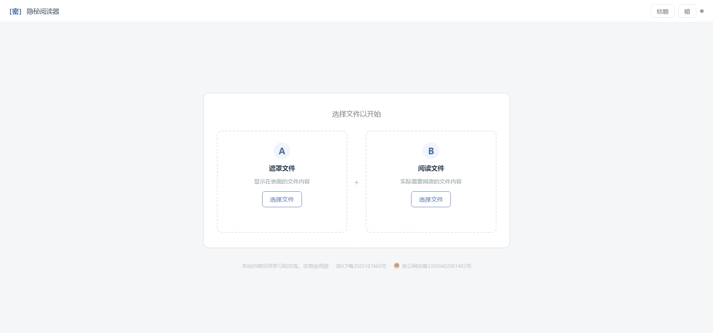

# 隐秘阅读器

一个基于 Web 的隐私阅读工具，通过在显示内容上叠加遮罩层，保护你在公共场合查看敏感文件时的隐私安全。

演示地址：https://yinmiread.937788.xyz/

## 工作原理

隐秘阅读器接受两个文件：

- **文件 A（遮罩文件）**：显示在表面的"伪装"内容，他人只能看到这份文件。
- **文件 B（阅读文件）**：隐藏在遮罩层下方的实际内容，只有你能看到。

当你滚动页面时，遮罩层会短暂淡出以露出下方的真实内容。滚动停止后，遮罩层自动恢复。你也可以按 `Esc` 键随时立即恢复遮罩。

## 功能特性

- **隐私遮罩**：文件 A 内容覆盖在文件 B 之上，滚动时临时显示底层内容
- **多格式支持**：支持 TXT、Markdown、PDF、DOCX、EPUB 文件
- **明暗主题**：支持明亮和暗夜两种主题模式，自动保存偏好
- **自定义标题**：可自定义页面标题，避免泄露浏览内容
- **响应式布局**：适配桌面端和移动端
- **纯前端运行**：所有文件解析均在浏览器本地完成，不会上传到服务器

## 技术栈

- 原生 JavaScript（无框架依赖）
- [Vite](https://vitejs.dev/) 构建工具
- PDF.js 用于 PDF 解析
- Mammoth.js 用于 DOCX 解析
- JSZip 用于 EPUB 解析

## 项目结构

```
cipher-reader/
├── index.html      # 主页面
├── main.js         # 核心逻辑（文件解析、遮罩控制、主题切换）
├── style.css       # 样式（CSS 变量、明暗主题、响应式布局）
├── vite.config.js  # Vite 配置
└── package.json    # 项目配置与依赖
```

## 快速开始

### 安装依赖

```bash
npm install
```

### 启动开发服务器

```bash
npm run dev
```

访问 `http://localhost:5173` 即可使用。

### 构建生产版本

```bash
npm run build
```

构建产物输出到 `dist/` 目录。

### 预览构建结果

```bash
npm run preview
```

## 使用说明

1. 打开页面后，在「遮罩文件」区域选择文件 A（他人看到的内容）
2. 在「阅读文件」区域选择文件 B（你想阅读的内容）
3. 两个文件都加载完成后，遮罩层自动覆盖在内容之上
4. 滚动鼠标滚轮或滑动触控板，遮罩短暂消失以露出底层内容
5. 停止滚动约 0.5 秒后，遮罩自动恢复
6. 按 `Esc` 键可立即恢复遮罩
7. 点击右下角浮动按钮可展开文件信息和更换文件
8. 点击右上角「标题」按钮可自定义页面标题

## 截图


